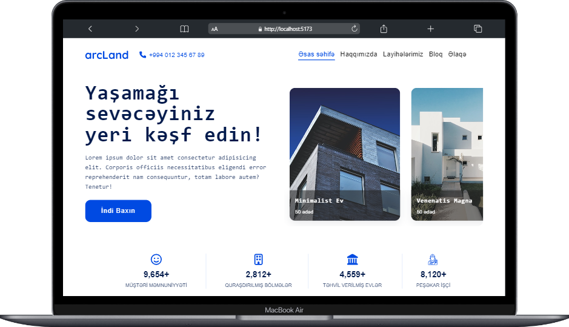
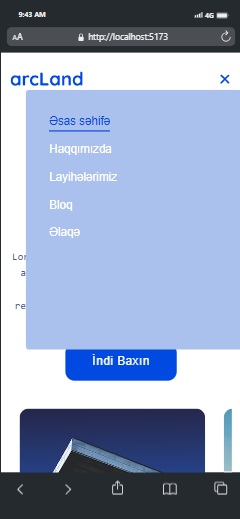

# Landing Page

This is a landing page for architecture company written with React JS and styled with Tailwind CSS frameworks.

## Table of contents

- [Overview](#overview)
  - [Screenshot](#screenshot) -[Installation](#installation)
- [Technologies that I used for this projects](#technologies-that-I-used-for-this-projects)
  - [React JS](#react-js)
  - [Vite](#vite)
  - [Tailwind CSS](#tailwind-css)
  - [Packages](#packages)
- [Contributing](#contributing)
- [License](#license)

## Overview

### Screenshot





### Installation

To run project locally wrote code line below in terminal of project root

```bash
npm run dev
```

## Technologies that I used for this projects

### React JS

[React](https://react.dev/) is a library/framework for JavaScript. To create and install environment for React JS I used Vite front end tool.

### Vite

[Vite](https://vitejs.dev/) is a platform-agnostic frontend tool for building web applications quickly and solves some common developer headaches.

```
npm create vite@latest
```

And for run

```
npm run dev
```

### Tailwind CSS

[Tailwind CSS](https://tailwindcss.com/) is a utility-first CSS framework. To configuration I used installation for frameworks and chose Vite+React. Installation guide wrote more detailed in [here](https://tailwindcss.com/docs/guides/vite).

### Packages

[Framer-motion](https://www.framer.com/motion/) : A production-ready motion library for React. I use to make page transitions and reveal animation by scrolling.

```
npm i framer-motion
```

[React-scroll-trigger](https://www.npmjs.com/package/react-scroll-trigger) : React component that monitors scroll events to trigger callbacks when it enters, exits and progresses through the viewport.

```
npm i react-scroll-trigger
```

[Scroll Carousel React](https://www.npmjs.com/package/scroll-carousel-react) : This is the react version of Scroll Carousel plugin, which is written in vanilla JavaScript.

```
npm i scroll-carousel-react
```

[Swiper JS](https://swiperjs.com/) : Swiper is the most modern free and open source mobile touch slider with hardware accelerated transitions and amazing native behavior.

```
npm i swiper
```

[React CountUp](https://www.npmjs.com/package/react-countup): A configurable React component wrapper around CountUp.js. I used for count up numbers in banner.

```
npm i react-countup
```

[React Router](https://www.npmjs.com/package/react-router) : Declarative routing for React web applications.

```
npm i react-router react-router-dom
```

[Helmet](https://www.npmjs.com/package/react-helmet) : This reusable React component will manage all of your changes to the document head.
Helmet takes plain HTML tags and outputs plain HTML tags. It's dead simple, and React beginner friendly.

```
npm i react-helmet
```

[Axios](https://www.npmjs.com/package/axios) : Promise based HTTP client for the browser and node.js. To fetch and get datas I generally use this package.

```
npm i axios
```

## Contributing

Pull requests are welcome. For major changes, please open an issue first
to discuss what you would like to change.

Please make sure to update tests as appropriate.

## License

[MIT](https://choosealicense.com/licenses/mit/)
